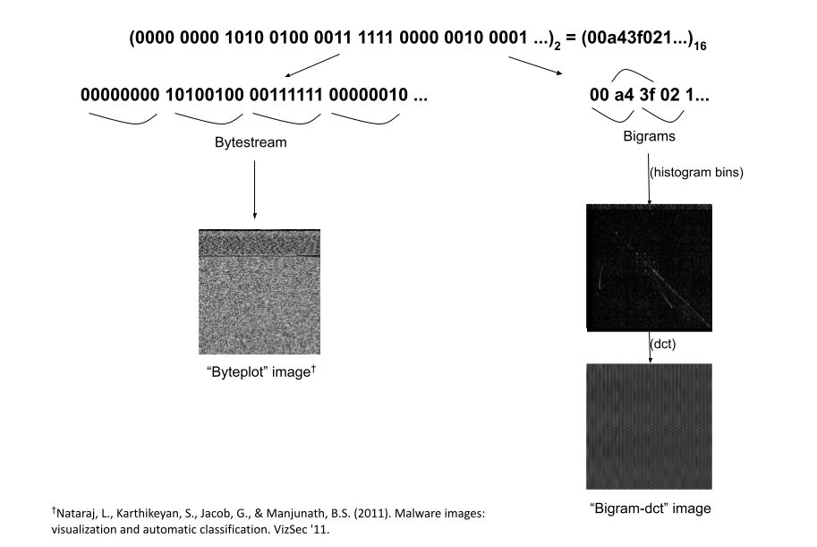

# MaleX

_MaleX_ is a curated dataset of malware and benign Windows executable samples for malware researchers. The dataset contains 1,044,394 Windows executable binaries and corresponding image representations with 864,669 labelled as malware and 179,725 as benign. This dataset has reasonable number of samples and is sufficient to test data-driven machine learning classification methods and also to measure the performance of the designed models in terms of scalability and adaptability.

## Malware Visualization in Frequency Domain

The motivation to visualize malware in frequency domain is because of the "sparse" feature representations of malware in literature that are typically extracted from raw bytes of the binaries or disassembled instructions (n-grams, n-perms).

A given executable binary file is read as a 16-bit signed hexadecimal vector and divided into corresponding bi-grams (n-grams of bytes with n=2). As an example, for the byte-stream _0a1bc48a_, the corresponding bi-grams will be _0a1b_, _1bc4_ and _c48a_. We then use the bi-gram frequency count to get a sparse image of dimensions 256x256 (where each pixel intensity value corresponds to normalized frequency count of a particular bi-gram). The image dimensions is the primary reason for choosing bi-grams (n=2) as it aids image-based machine learning classification with low time complexity in the training phase. Finally, we compute the full frame Discrete Cosine Transform (DCT) of this image to de-sparsify and get a resulting "bigram-dct" image with distinctive textured patterns. Before normalizing frequency count to get the sparse image, we zero out the first frequency count value corresponding to the bi-gram _0000_, as this value is relatively very large compared to that of other bi-grams and the bi-gram either corresponds to empty space or new line(s) in the code with no useful information. The overview of the proposed feature extraction method is shown below.


```diff
+ CODE TO CONVERT BINARIES TO IMAGES IS NOW AVAILABLE
```

## Comparing Malware Visualization Methods

Previous research has shown that malware variants belonging to the same family exhibit visual similarity in the byteplot images. These are based on visualization of malware binaries in the spatial domain by converting bytes to pixels. The frequency domain-based visualization is another such "orthogonal" depiction of malware binary that is shown (in our paper, [Malware Detection Using Frequency Domain-Based Image Visualization and Deep Learning](https://arxiv.org/abs/2101.10578)) to aid computer vision algorithms to detect malware. The comparison of the byteplot and "bigram-dct" representations is shown in the figure below.



## Download Policy

We are not responsible, or liable to you or any third party, for the content or accuracy of any materials provided by us. The release of data is conditioned on accepting the following terms to avoid the dataset being misused.

- If you are a student (or postdoc) in academia, please ask your advisor (or host) to fill out the [form](https://mayachitra.com/#contact-us) with subject that starts with [MaleX Request]. If you are a faculty member, please provide university's email account in the form. In your message, please include your name, affiliation, and homepage. The information is needed for verification purpose.
- If you are in research (industrial) labs, please fill out the [form](https://mayachitra.com/#contact-us) by providing your company's email account with subject that starts with [MaleX Request]. In the message, please briefly introduce yourself (e.g., name and title) and your company. In the form, please attach a justification letter (in PDF format) in official letterhead. The justification letter needs to acknowledge the "MaleX Malware Dataset" from Mayachitra, Inc. and state clearly the reasons why the dataset is being requested.

Please note that, your request will be ignored if you are unable to follow these conditions. Also, while filling out the form, please make sure that the **message's character length is between 20 and 1000**, and/or the **PDF attachment is less than 2MB**.

```diff
+ IMAGES AND/OR FEATURES CAN BE REQUESTED FOR DOWNLOAD
- BINARIES ARE NOT MADE AVAILABLE AT THIS TIME
```

## Citing

If you use _MaleX_ in your research or wish to refer to the content published here, please use the following BibTeX entry to cite our paper, [Malware Detection Using Frequency Domain-Based Image Visualization and Deep Learning (2021)](https://arxiv.org/abs/2101.10578):

```bibtex
@inproceedings{mohammedmalware,
  title={Malware Detection Using Frequency Domain-Based Image Visualization and Deep Learning},
  author={Mohammed, Tajuddin Manhar and Nataraj, Lakshmanan and Chikkagoudar, Satish and Chandrasekaran, Shivkumar and Manjunath, BS},
  booktitle={Proceedings of the 54th Hawaii International Conference on System Sciences},
  pages={7132},
  year={2021}
}
```

## Related Works

The Malimg Dataset that contains 9,339 malware byteplot images from 25 families can be downloaded [here](https://drive.google.com/file/d/1M83VzyIQj_kuE9XzhClGK5TZWh1T_pr-/view).

Please feel free to check out our other related published works:

- [SPAM: Signal Processing to Analyze Malware (2016)](https://arxiv.org/abs/1605.05280)
- [OMD: Orthogonal Malware Detection Using Audio, Image, and Static Features (2021)](https://arxiv.org/abs/2111.04710)
- [HAPSSA: Holistic Approach to PDF Malware Detection Using Signal and Statistical Analysis (2021)](https://arxiv.org/abs/2111.04703)

Also, check out our web-accessible service, [MalSee](https://malsee.mayachitra.com/) that recasts suspect software binaries as images and exploits computer vision techniques to automatically detect malware.

## Contact Us

Mayachitra, Inc. <br />
5266 Hollister Ave, Suite 229, Santa Barbara, CA, 93111 <br />

Have more questions? Write to us by filling in this [form](https://mayachitra.com/#contact-us).

## License

_MaleX_ is released under GPL-3.0 License.

Copyright © 2022 [Mayachitra, Inc.](https://mayachitra.com/)
